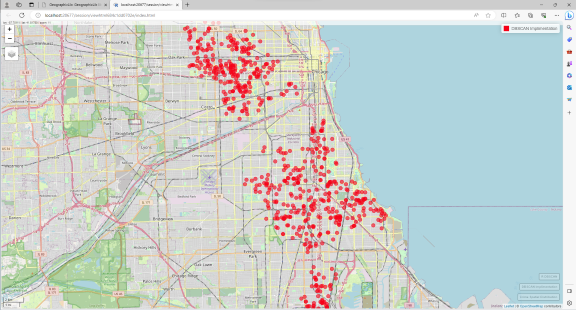

# Abstract

The purpose of this project was to identify clustering patterns of crime data throughout the city of Chicago. I started by importing all available data and reviewed the temporal distributions of each individual crime category. Three crime categories were selected for further analysis: Homicide, Assault, and Motor Vehicle Theft. I performed DBSCAN, HDBSCAN, and Kmeans clustering on each crime category to identify density and spatial patterns for the crimes. I discovered that the crimes do not appear in a random manner. There tend to be similarities between clusters of different crimes, indicating that there could be socio-economic factors affecting the spatial distribution of crime throughout the City.

------------------------------------------------------------------------

# Data Exploration

Our first task was to import the data and view the hourly, daily, and monthly distribution of crimes in the city. The figures for the entire data set are included in the appendix. I found it more insightful to graph the hourly crime distribution in a stacked histogram to compare temporal distribution between crime categories. As one would expect, crime frequency in all categories tended to increase at night.

Spatially mapping the data did not provide much insight initially. There were too many points to really identify patterns within the data. A shot of the interactive map is included below.

```{r data_exploration, include=TRUE,echo=TRUE}
library(stringr)
library(rmarkdown)
library(sf)
library(ggplot2)
library(dplyr)
library(stringi)
library(lubridate)
library(mapview)
library(leafpop)
library(spatstat)
library(dbscan)
library(RColorBrewer)
library(nngeo)
library(tibble)
library(factoextra)
library(png)
library(spatstat)
library(tidyr)
library(knitr)

knitr::opts_chunk$set(echo=TRUE, include = TRUE, fig.width = 5, fig.height = 3,
                      fig.align = 'center')
data=read.csv('CrimesChicago20220225.csv')
data=data[,c('DATE..OF.OCCURRENCE','PRIMARY.DESCRIPTION','BEAT',
              'WARD','LATITUDE','LONGITUDE')]
data=na.omit(data)
data$DATE..OF.OCCURRENCE=as.POSIXlt(data$DATE..OF.OCCURRENCE,
                                    tz='America/Detroit',
                                    tryFormats ='%m/%d/%Y %I:%M:%S %p')
data=data%>%
  rename(DATE=DATE..OF.OCCURRENCE,DESCRIPTION=PRIMARY.DESCRIPTION)

data=data%>%
  rename_with(.fn = function(x){str_to_title(x)})%>%
  mutate(Day=wday(Date,label=TRUE)) %>%
  mutate(Month=month(Date,label=TRUE))%>%
  mutate(Hour=hour(Date))

#Hourly Crime Distribution
ggplot(data = data, aes(x=Hour))+
  stat_count(fill='lightblue',color='black')+
  labs(title = 'Hourly Crime Distribution')+
  ylab('Frequency')+
  scale_x_discrete(breaks=1:23, limits=as.character(1:23))+
  theme_gray()+
  theme(plot.title = element_text(hjust = 0.5, size = 12))

#daily crime distribution
knitr::opts_chunk$set(echo = TRUE)
ggplot(data = data, aes(x=Day))+
  stat_count(fill='lightblue',color='black')+
  labs(title='Daily Crime Distribution')+
  xlab('Day')+
  ylab('Frequency')+
  scale_x_discrete()+
  theme_gray()+
  theme(plot.title = element_text(hjust = 0.5, size = 12))

#monthly crime distribution
ggplot(data = data, aes(x=Month))+
  stat_count(fill='lightblue',color='black')+
  labs(title='Monthly Crime Distribution')+
  ylab('Frequency')+
  scale_x_discrete()+
  theme_gray()+
  theme(plot.title = element_text(hjust = 0.5, size = 12))

#monthly crime distribution
ggplot(data = data, aes(x=Description))+
  stat_count(fill='lightblue',color='black')+
  labs(title='Crime Distribution by Category')+
  ylab('Frequency')+
  theme_grey()+
  theme(axis.text.y = element_text(size = 7))+
  coord_flip()+
  theme(plot.title = element_text(hjust = 0.5, size = 12))

#group according to crime "category"
data_filtered=data%>%
  mutate(Category=case_when(str_detect(Description,'HOMICIDE')~'Homicide',
                        str_detect(Description,'ASSAULT')~'Assault',
                        str_detect(Description,'MOTOR VEHICLE THEFT')~'Vehicle Theft',
                        .default = 'Other' ))%>%
  filter(str_detect(Category,'Homicide|Assault|Vehicle Theft'))


```

```{r}
#hourly crime distribution by category of crime
data_filtered%>%
  group_by(Category,Hour)%>%
  ggplot(aes(x=Hour,fill=Category))+
  labs(title='Hourly Crime Distribution')+
  ylab('Frequency')+
  stat_count(color='black')+
  scale_x_discrete(breaks=1:23, limits=as.character(1:23))+
  theme_grey()+
  theme(plot.title = element_text(hjust = 0.5, size = 12))

#mapping
data_sf=st_as_sf(data_filtered,
                 coords = c('Longitude','Latitude'),
                 crs = 'EPSG:4326')
data_sf=data_sf%>%
  filter(!is.na(geometry))
shp=list.files(pattern = '.shp')
mapviewOptions(basemaps='OpenStreetMap', fgb = FALSE)
crime_map=mapview(data_sf,
                  zcol='Category',
                  col.regions=brewer.pal(3,'Dark2'),
                  legend=TRUE,
                  popup=popupTable(x=data_sf,
                                   row.numbers=FALSE,
                                   feature.id=FALSE),
                  layer.name='Crime Spatial Distribution')


```

Spatially mapping the data did not provide much insight initially. There were too many points to really identify patterns within the data. A shot of the interactive map is included below.

```{r}
crime_map
```

------------------------------------------------------------------------

# Spatial Clustering

To provide some sort of baseline for verifying clusters, I began clustering by creating a density plot using ggplot. For all crime categories, we can see some patterns imurge from the density plots.

```{r Homicide}
#extract relevant category
homicide=data_sf%>%
  filter(Category=='Homicide')%>%
  st_coordinates()%>%
  as.data.frame()
  colnames(homicide)=c('Longitude','Latitude')
  
#make a density plot for reference
ggplot(data=homicide,aes(x=Longitude, y=Latitude))+
  geom_density2d_filled(bins=5, color='white')+
  labs(title='Homicide Crime Density',
       caption = ('CRS:WGS84'))+
  theme_grey()+
  theme(plot.title = element_text(hjust = 0.5, size = 12),
        legend.position = 'none')
```

I decided to plot the kNN distance for each category at a "high" and "low" k values to help select my eps and minPts values in the DBSCAN. Using these values helped to decrease the amount of "noise" in each clustering pattern, but did not really provide much insight into crime hotspots. If the goal of this project is to locate neighborhoods with the most prevalent crime, I had to do a combination of lowering the eps value and increasing the minPts.

```{r}
#nearest distance to 100th neighbor for minPts=10
knn_10=sort(kNNdist(homicide,k=10))
plot(knn_10, main = '10th-Nearest Neighbor Distance (Ordered)',
     xlab = NA,
     ylab = 'eps Approximation',
     type = 'l',
     las=2)+
grid()

#nearest distance to 100th neighbor for minPts=10
knn_10=sort(kNNdist(homicide,k=10))
plot(knn_10, main = '10th-Nearest Neighbor Distance (Ordered)',
     xlab = NA,
     ylab = 'eps Approximation',
     type = 'l',
     las=2)+
grid()
```

The eps and minPts variables have a profound effect on the clustering of the data. From some general reading and study of these plots, I have found that eps and minPts should be selected based on the goal of pattern recognition. If we would like to minimize the amount of noise in the clustering, we should have high eps and low minPts. If we would like to pick out hotspots and identify patterns on a more granular level, it helps to have a lower eps and high minPts. There are instances where both cases would be useful.

The minPts also had to be adjusted for the number of crimes within each category. Homicide, the smallest data set, had a much smaller minPts than Assault or Motor Vehicle Theft.

```{r}
#high eps relative to low min pts
homicide%>%
dbscan(eps=0.014, minPts = 10)%>%
fviz_cluster(data = homicide, geom = 'point',
               main = 'DBSCAN Clustering of Homicide Crimes', pointsize = 0.05)+
  theme(plot.title = element_text(hjust = 0.5, size = 12))

#low eps relative to high min pts
db_homicide=homicide%>%
dbscan(eps=0.03, minPts = 75)
fviz_cluster(db_homicide,data = homicide, geom = 'point',
               main = 'DBSCAN Clustering of Homicide Crimes', pointsize = 0.05)+
  theme(plot.title = element_text(hjust = 0.5, size = 12))
```

The HDBSCAN was very computation intensive. When I ran the hdbscan() command on larger subcategories, I would usually get some sort of memory related error. I had to change my selected categories a few times to solve this problem. I did find that some research has been done in the area of random sampling for spatial pattern analysis, but I did not want to run the risk of skewing patterns.

With identical minPts, the HDBSCAN dendrogram agreed with the dbscan, which is to be expected.

```{r}
#HDBSCAN clustering for centroid
hb_homicide=homicide%>%
  as.matrix()%>%
  dist()%>%
  hdbscan(minPts=10)
plot(hb_homicide)
```

Kmeans clustering is more distance based than density based. It produced clusters that covered the extent of the area. For recognizing patterns that are density related like crime hot spots, it would not be very useful.

```{r}
#kmeans clustering
k_homicide=homicide%>%
  scale()%>%
  kmeans(centers = 5)
fviz_cluster(k_homicide,data=homicide, geom = 'point',
               main = 'Kmeans Clustering of Homicide Crimes', pointsize = 0.05)+
  theme(plot.title = element_text(hjust = 0.5, size = 12))

homicide_clust_geo=cbind(homicide,db_homicide$cluster,hb_homicide$cluster,k_homicide$cluster)
homicide_clust_geo=st_as_sf(homicide_clust_geo,
           coords = c('Longitude','Latitude'),
           crs=4326)
```

In all three categories, the DBSCAN showed between 2 and 4 clusters that are located in similar areas. We can visually infer that these could be considered crime prevalent neighborhoods.The number of clusters in Kmeans is input by the user (five in this case) but tends to follow a similar pattern for each of the crime categories since it is not density based. The HDBSCAN dendrogram showed more insight to when an area is initially able to be considered a cluster when it meets the minPts requirement.

```{r Assault, echo=FALSE}
#extract relevant category
assault=data_sf%>%
  filter(Category=='Assault')%>%
  st_coordinates()%>%
  as.data.frame()
  colnames(assault)=c('Longitude','Latitude')
  
#make a density plot for reference
ggplot(data=assault,aes(x=Longitude, y=Latitude))+
  geom_density2d_filled(bins=5, color='white')+
  labs(title='Assault Crime Density',
       caption = ('CRS:WGS84'))+
  theme_grey()+
  theme(plot.title = element_text(hjust = 0.5, size = 12),
        legend.position = 'none')

#nearest distance to 100th neighbor for minPts=100
knn_50=sort(kNNdist(assault,k=50))
plot(knn_50, main = '50th-Nearest Neighbor Distance (Ordered)',
     xlab = NA,
     ylab = 'eps Approximation',
     type = 'l',
     las=2)+
grid()

#nearest distance to 1000th neighbor for minPts=1000
knn_500=sort(kNNdist(assault,k=500))
plot(knn_500, main = '500th-Nearest Neighbor Distance (Ordered)',
     xlab = NA,
     ylab = 'eps Approximation',
     type = 'l',
     las=2)+
grid()

#high eps relative to low min pts
assault%>%
dbscan(eps=.015, minPts = 50)%>%
fviz_cluster(data = assault, geom = 'point',
               main = 'DBSCAN Clustering of Assault Crimes', pointsize = 0.05)+
  theme(plot.title = element_text(hjust = 0.5, size = 12))

#low eps relative to high min pts
db_assault=assault%>%
dbscan(eps=.015, minPts = 500)
fviz_cluster(db_assault,data = assault, geom = 'point',
               main = 'DBSCAN Clustering of Assault Crimes', pointsize = 0.05)+
  theme(plot.title = element_text(hjust = 0.5, size = 12))

#HDBSCAN clustering for centroid
hb_assault=assault%>%
  as.matrix()%>%
  dist()%>%
  hdbscan(minPts=500)
plot(hb_assault)

#kmeans clustering
k_assault=assault%>%
  scale()%>%
  kmeans(centers = 5)
fviz_cluster(k_assault,data=assault, geom = 'point',
               main = 'Kmeans Clustering of Assault Crimes', pointsize = 0.05)+
  theme(plot.title = element_text(hjust = 0.5, size = 12))

assault_clust_geo=cbind(assault,db_assault$cluster,hb_assault$cluster,k_assault$cluster)
assault_clust_geo=st_as_sf(assault_clust_geo,
           coords = c('Longitude','Latitude'),
           crs='EPSG:26916')%>%
  st_transform(crs=4326)
```

```{r Vehicle, echo=TRUE}
#extract relevant category
vehicle=data_sf%>%
  filter(Category=='Vehicle Theft')%>%
  st_coordinates()%>%
  as.data.frame()
  colnames(vehicle)=c('Longitude','Latitude')
  
#make a density plot for reference
ggplot(data=vehicle,aes(x=Longitude, y=Latitude))+
  geom_density2d_filled(bins=5, color='white')+
  labs(title='Vehicle Theft Crime Density',
       caption = ('CRS:WGS84'))+
  theme_grey()+
  theme(plot.title = element_text(hjust = 0.5, size = 12),
        legend.position = 'none')

#nearest distance to 100th neighbor for minPts=100
knn_50=sort(kNNdist(vehicle,k=50))
plot(knn_50, main = '50th-Nearest Neighbor Distance (Ordered)',
     xlab = NA,
     ylab = 'eps Approximation',
     type = 'l',
     las=2)+
grid()

#nearest distance to 1000th neighbor for minPts=1000
knn_500=sort(kNNdist(vehicle,k=500))
plot(knn_500, main = '500th-Nearest Neighbor Distance (Ordered)',
     xlab = NA,
     ylab = 'eps Approximation',
     type = 'l',
     las=2)+
grid()

#high eps relative to low min pts
vehicle%>%
dbscan(eps=.01, minPts = 50)%>%
fviz_cluster(data = vehicle, geom = 'point',
               main = 'DBSCAN Clustering of Vehicle Theft Crimes', pointsize = 0.05)+
  theme(plot.title = element_text(hjust = 0.5, size = 12))

#low eps relative to high min pts
db_vehicle=vehicle%>%
dbscan(eps=.02, minPts = 400)
fviz_cluster(db_vehicle,data = vehicle, geom = 'point',
               main = 'DBSCAN Clustering of Vehicle Theft Crimes', pointsize = 0.05)+
  theme(plot.title = element_text(hjust = 0.5, size = 12))

#HDBSCAN clustering for centroid
hb_vehicle=vehicle%>%
  as.matrix()%>%
  dist()%>%
  hdbscan(minPts=500)
plot(hb_vehicle)

#kmeans clustering
k_vehicle=vehicle%>%
  scale()%>%
  kmeans(centers = 5)
fviz_cluster(k_vehicle,data=vehicle, geom = 'point',
               main = 'Kmeans Clustering of Vehicle Theft Crimes', pointsize = 0.05)+
  theme(plot.title = element_text(hjust = 0.5, size = 12))

vehicle_clust_geo=cbind(vehicle,db_vehicle$cluster,hb_vehicle$cluster,k_vehicle$cluster)
vehicle_clust_geo=st_as_sf(vehicle_clust_geo,
           coords = c('Longitude','Latitude'),
           crs='EPSG:26916')%>%
  st_transform(crs=4326)
```

------------------------------------------------------------------------

# Spatial Structure

To determine spatial structure, I first calculated the distance between each cluster within the same category. The minimum distance between closest clusters for each category was very similar. This can indicate that there is a lack of spatial randomness between different crimes.

To test this, I also calculated the distance between cluster centers of all crimes. These minimum distances were very low relative to the minimum cluster distance within the same category. This can be used to prove the hypothesis that different types of crimes are also clustered.

```{r}
#renaming columns
homicide=cbind(homicide,homicide_clust_geo)
colnames(homicide)=c('Longitude','Latitude','DBSCAN','HDBSCAN','Kmeans','geometry')
assault=cbind(assault,assault_clust_geo)
colnames(assault)=c('Longitude','Latitude','DBSCAN','HDBSCAN','Kmeans','geometry')
vehicle=cbind(vehicle,vehicle_clust_geo)
colnames(vehicle)=c('Longitude','Latitude','DBSCAN','HDBSCAN','Kmeans','geometry')

#cluster centers by mean aka centroid
homicide_cent=homicide%>%
  filter(DBSCAN>0)%>%
  group_by(DBSCAN)%>%
  summarise(lat=mean(Latitude),long=mean(Longitude))
assault_cent=assault%>%
  filter(DBSCAN>0)%>%
  group_by(DBSCAN)%>%
  summarise(lat=mean(Latitude),long=mean(Longitude))
vehicle_cent=vehicle%>%
  filter(DBSCAN>0)%>%
  group_by(DBSCAN)%>%
  summarise(lat=mean(Latitude),long=mean(Longitude))
```

```{r}
homicide_cent%>%
  st_as_sf(coords = c('lat','long'),
         crs = 'EPSG:4326')%>%
  st_nn(.,.,k=2,returnDist = TRUE)%>%
  unlist()
```

```{r}
st_as_sf(assault_cent,
         coords = c('lat','long'),
         crs = 'EPSG:4326')%>%
  st_nn(.,.,k=2,returnDist = TRUE)%>%
  unlist()
```

```{r}
st_as_sf(vehicle_cent,
         coords = c('lat','long'),
         crs = 'EPSG:4326')%>%
  st_transform(crs=4326)%>%
  st_nn(.,.,k=2,returnDist = TRUE)%>%
  unlist()
```

```{r}
x=homicide_cent%>%
  add_column(Crime='Homicide')
y=vehicle_cent%>%
  add_column(Crime='Vehicle Theft')
z=assault_cent%>%
  add_column(Crime='Assault')
all_clusters=rbind(x,y,z)

distances=all_clusters%>%
  st_as_sf(coords = c('lat','long'),
         crs = 'EPSG:4326')%>%
  st_transform(crs=4326)%>%
  st_nn(.,.,k=2,returnDist = TRUE)

distances[2]
```

------------------------------------------------------------------------

# Clustering Method Implementation

I implemented my own clustering method using the st_nn() function. This function will return the k-th nearest neighbors as a list of points. The k and maxdist arguments can function as the minPts and eps arguments in the dbscan function however maxdist is reported in meters.

The implimentation was successful and showed a very similar pattern that the dbscan method did and I could probably achieve greater similarity by manipulating the maxdist argument to match the lat/long distance in the dbscan eps argument.

```{r}
my_dbscan=st_nn(homicide_clust_geo$geometry,homicide_clust_geo$geometry,k=11,maxdist = 1500)%>%
  tibble()%>%
  unnest_wider(.,col = ., names_sep='point')%>%
  add_column(Longitude=homicide$Longitude,Latitude=homicide$Latitude)%>%
  drop_na(any_of(2:11))%>%
  st_as_sf(coords=c('Longitude','Latitude'),
           crs=4326)

crime_map=crime_map+mapview(my_dbscan,
                            color='red',
                            col.regions='red',
                            layer.name='DBSCAN Implimentation')
R_dbscan=homicide%>%
  filter(DBSCAN>0)%>%
  select(geometry)%>%
  st_as_sf(crs=4326)

crime_map=crime_map+mapview(R_dbscan,
                  color='black',
                  layer.name='R DBSCAN')


```

------------------------------------------------------------------------

# Summary/Concluding Remarks

This project sought to identify patterns for crime in chicago through clustering. The density based clustering methods are most useful for identify frequency patterns. I was trying to find crime hotspots similar to those that would show up in a density plot and was successful in doing so. The DBSCAN method also showed clusters that I would not have know existed otherwise. While there are instances that Kmeans clustering is useful, it does not provide meaningful insight into this data other than its spatial extent. From the patterns seen on the DBSCAN plots and the calculated distances between clusters, we can see that there are similarities in the spatial distribution between different crime categories.

# Appendix
